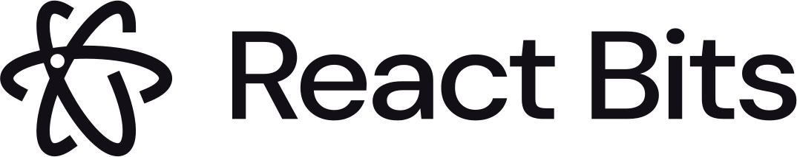
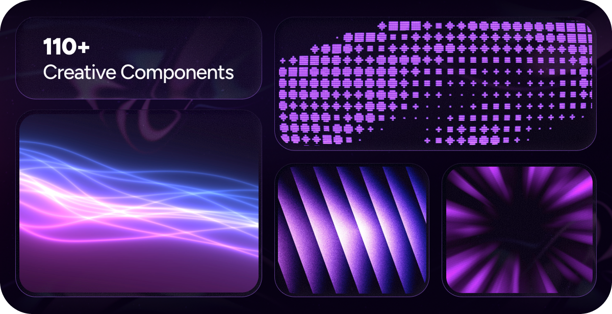

<div align="center">
	<br>
	<br>
    <picture>
      <source media="(prefers-color-scheme: light)" srcset="src/assets/logos/reactbits-gh-black.svg">
      <source media="(prefers-color-scheme: dark)" srcset="src/assets/logos/reactbits-gh-white.svg">
      
    </picture>
	<br>
	<br>
  <strong>The largest & most creative library of animated React components.</strong>
  <br />
  <sub>Stand out with 110+ free, customizable animations for text, backgrounds, and UI.</sub>
	<br>
	<br>
  <a href="https://github.com/anthonymengottii/components_library/stargazers"></a>
  <a href="https://github.com/anthonymengottii/components_library/blob/main/LICENSE.md"></a>
  <br>
  <br>
  <a href="https://github.com/anthonymengottii/components_library">📖 Documentation</a> · <a href="https://github.com/anthonymengottii/components_library/get-started/installation">⚡ Quick Start</a> · <a href="https://github.com/anthonymengottii/components_library/tools">🛠️ Tools</a>
</div>

<br />

<div align="center">
  
</div>

<br />

## ✨ Why Components Library?

Components Library helps you **ship stunning interfaces faster**. Instead of spending hours crafting animations from scratch, grab a polished component and customize it to fit your vision.

> 💬 **Text Animations** · 🌀 **Animations** · 🧩 **Components** · 🖼️ **Backgrounds**

## 🚀 Features

- **110+ components** — text animations, UI elements, and backgrounds, growing weekly
- **Minimal dependencies** — lightweight and tree-shakeable
- **Fully customizable** — tweak everything via props or edit the source directly
- **4 variants per component** — JS-CSS, JS-TW, TS-CSS, TS-TW (everyone's happy)
- **Copy-paste ready** — works with any modern React project

## 🛠️ Creative Tools

<div align="center">
  
</div>

<hr />

### Beyond components, Components Library offers **free creative tools** to supercharge your workflow:

| Tool                                                 | What it does                                                                             |
| ---------------------------------------------------- | ---------------------------------------------------------------------------------------- |
| **[Background Studio](https://github.com/anthonymengottii/components_library/tools)** | Explore animated backgrounds, customize effects, export as video/image/code              |
| **[Shape Magic](https://github.com/anthonymengottii/components_library/tools)**       | Create inner rounded corners between shapes, export as SVG, React code or clip-path code |
| **[Texture Lab](https://github.com/anthonymengottii/components_library/tools)**       | Apply 20+ effects (noise, dithering, ASCII) to images/videos and export in high quality  |

## 📦 Installation

Components Library supports [shadcn](https://ui.shadcn.com/) and [jsrepo](https://jsrepo.dev) for quick CLI installs.

```bash
# Example: Add a component via shadcn
npx shadcn@latest add @components-library/BlurText-TS-TW
```

Each component page includes copy-ready CLI commands. See the [installation guide](https://github.com/anthonymengottii/components_library/get-started/installation) for full details.

You can also select your preferred technologies, and copy the code manually.

<hr />

## 🤝 Contributing

We'd love your help! Check the [open issues](https://github.com/anthonymengottii/components_library/issues) or submit ideas via the [feature request template](https://github.com/anthonymengottii/components_library/issues/new?template=2-feature-request.yml).

Please read the [contribution guide](https://github.com/anthonymengottii/components_library/blob/main/CONTRIBUTING.md) first — thanks for making Components Library better!

## 🙌 Contributors

<a href="https://github.com/anthonymengottii/components_library/graphs/contributors">
  
</a>

## 👤 Maintainer

**[Anthony Mengotti](https://github.com/anthonymengottii)** — creator & maintainer

## 🌐 Official Ports

| Framework | Link                                  |
| --------- | ------------------------------------- |
| Vue.js    | [vue-bits.dev](https://vue-bits.dev/) |

## 📊 Stats


## 🗳️ Credit

Components Library occasionally draws inspiration from publicly available code examples. These are rewritten as full-fledged, customizable components for JS, TS, CSS, and Tailwind. If you recognize your work, [open an issue](https://github.com/anthonymengottii/components_library/issues) to request credit.

## 📄 License

[MIT + Commons Clause](https://github.com/anthonymengottii/components_library/blob/main/LICENSE.md) — free for personal and commercial use.
